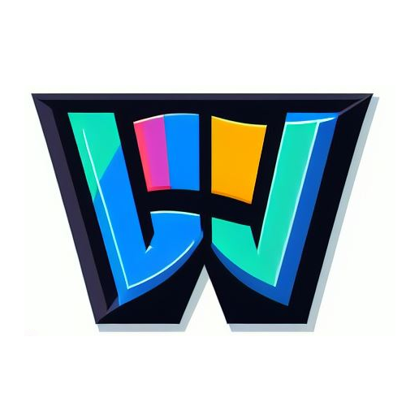

<p align="center"></p>

<p align="center" style="text-align:center;">
<span style="font-size: 2.5em; font-weight: 600;">Dabaliu</span>
</p>

# Sobre el proyecto

## Descripción general del proyecto

Dabaliu es una plataforma de cursos online, donde se pondrá a disposición de los usuarios la posibilidad de comprar y matricularse en cursos de formación que pueden ser gratuitos o de pago. Del mismo modo se permitirá a los usuarios autorizados crear sus propios cursos y ofrecerlos desde la plataforma.

## Funcionalidad principal de la aplicación

Ofrecer un espacio de aprendizaje para usuarios interesados en obtener conocimientos, y una manera lucrativa de compartir conocimientos y enseñar a otros usuarios, con el atractivo de poder generar ingresos a través de sus cursos.

## Objetivos generales

- Ver el catálogo de cursos disponibles y gestionar los cursos adquiridos.
- Ofrecer un segumiento del curso a los alumnos y permitir a los alumnos realizar reseñas de los cursos adquiridos.
- Comunicaciones entre alumnos y profesores a través de comentarios.
- Gestionar los cursos publicados por los profesores y ofrecer a éstos un apartado de administración de los cursos aprobados o rechazados.

## Elemento de innovación

- Laravel 10: Es un framework para aplicaciones webs escrito en PHP y basado en el patrón MVC con el que relizaremos nuestra aplicación.
- Livewire: Es un framework para desarrollar el apartado frontend de nuestra aplicación en Laravel, permitiendo crear componentes dinámicos que podremos incluir a nuestras vistas para aportar interactividad.
- Jetstream: Se rata de un "starter kit" de Laravel, similar a Breeze, que mediante Tailwind CSS y Livewire nos brinda un punto de partida para desarrollar nuestra aplicación.
- LaravelPermissions: Es un paquete desarrollado por Spatie que nos permite administrar los permisos de los usuarios y roles.
- Pagos a través de Paypal: Vamos a ofrecer la posibildad de realizar pagos mediante Paypal, conectándonos a su API. Utilizaremos el entorno de pruebas "sandbox" que nos ofrece para realizar la implementación y verificar su funcionamiento en nuestra aplicación.

## Licencia

Esta aplicación y el Framework Laravel son software de código abierto licenciado bajo la [licencia MIT](https://opensource.org/licenses/MIT).

# Instalación

## Requisitos

Esta aplicación ha sido desarrollada con las siguientes versiones de software, por lo que se recomienda utilizar estas versiones o superiores para su correcto funcionamiento:

- PHP 8.2.15

- Composer 2.6.2

- Node.js 18.19.0

- NPM 10.2.3

- PostgreSQL 14.10

## Pasos para la instalación
1. Clonar el repositorio, ya sea:

    1. Mediante gh: `gh repo clone edumarrom/dabaliu`

    2. Mediante git `git clone https://github.com/edumarrom/dabaliu.git`

2. Instalar las dependencias de composer: `composer install`

3. Instalar las dependencias de npm: `npm install`

4. Crear el archivo .env a partir del .env.example: `cp .env.example .env`

5. Generar la clave de la aplicación: `php artisan key:generate`

6. Generar el enlace simbólico para el almacenamiento de archivos: `php artisan storage:link`

7. Configurar la base de datos en el archivo .env

8. Configurar el email y la contraseña del usuario admin en el archivo .env:

    ```env
    ADMIN_EMAIL="fulano@detal.com"
    ADMIN_PASSWORD="C0ntr@s3ñA"
    ```
    > Puedes dejar los valores por defecto si lo deseas.

9. Ejecutar las migraciones y los seeders: `php artisan migrate --seed`

10. Ejecutar el servidor de desarrollo: `php artisan serve`

11. Compilar los assets:

    1. `npm run build` para compilar los assets en producción.

    2. `npm run dev` para mantener al compilador a la escucha de cambios y compilarlos en tiempo real.

12. Acceder a la aplicación en el navegador: `http://dabaliu.test:8000`
